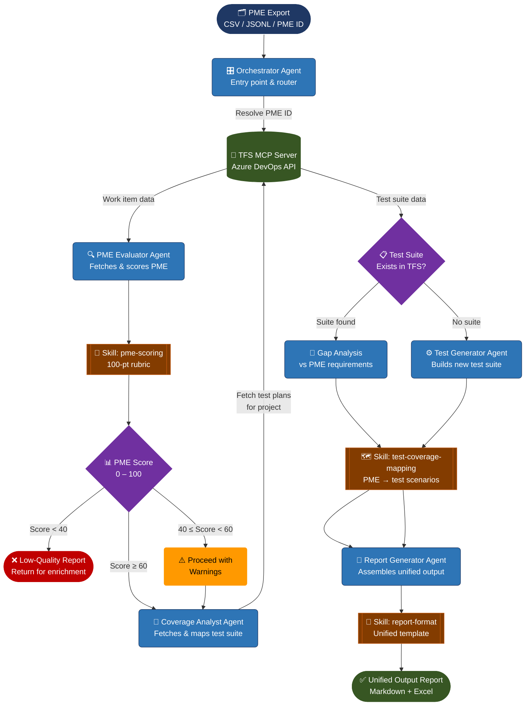
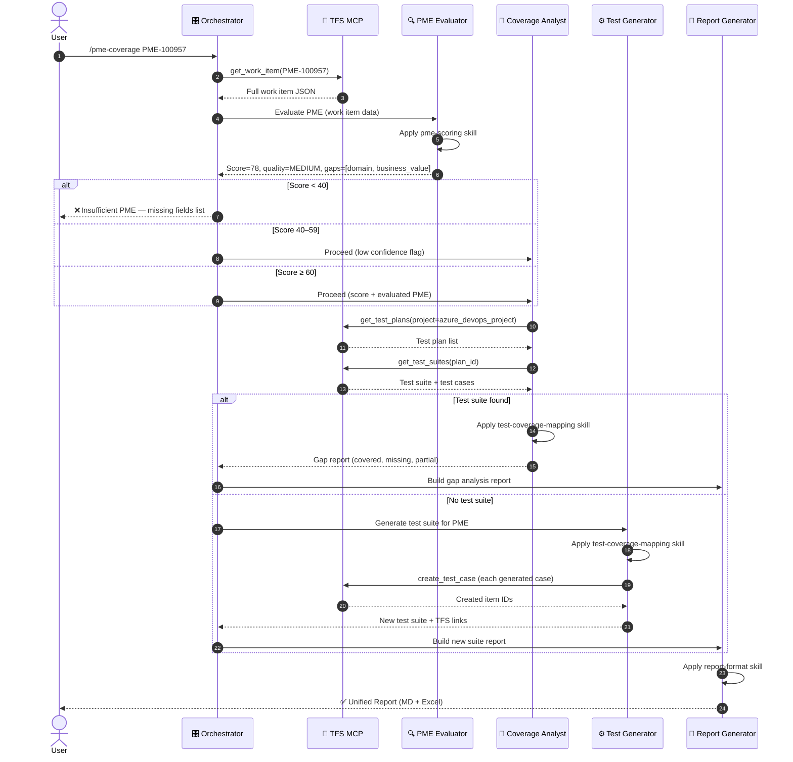
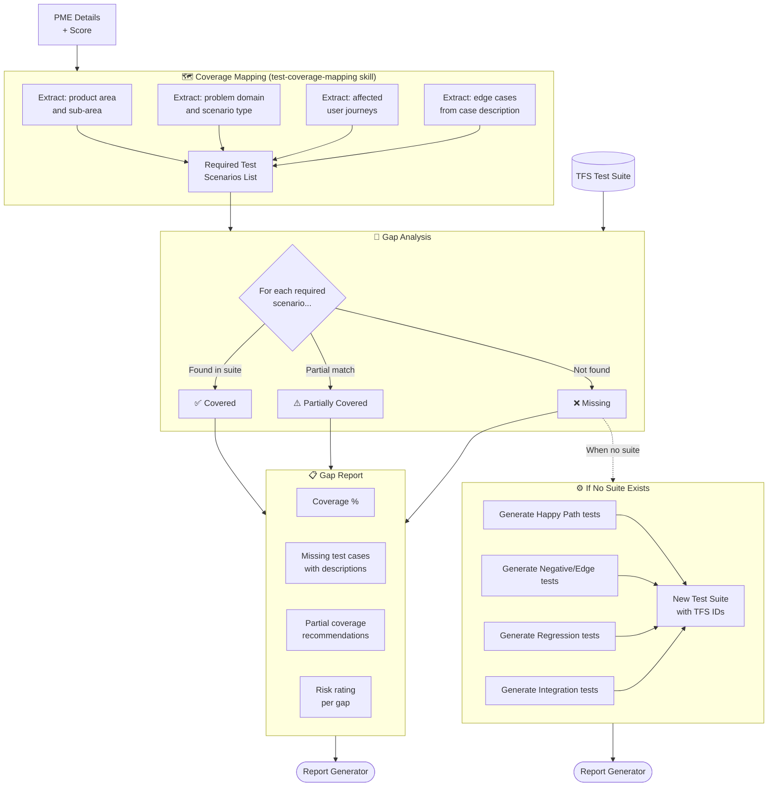

# Architecture — PME Agentic Evaluation & Test Coverage Engine

---

## 1. System Overview

The system is a **multi-agent pipeline** built on the Claude Agent SDK, connected to TFS/Azure DevOps through an MCP server. It operates as a directed workflow with conditional branching based on PME quality scores and test suite availability.

```
┌─────────────────────────────────────────────────────────────────────────┐
│                        PME AGENTIC FLOW SYSTEM                          │
│                                                                         │
│  INPUT LAYER          AGENT LAYER              OUTPUT LAYER             │
│  ┌──────────┐        ┌─────────────┐          ┌──────────────────────┐ │
│  │ PME CSV  │        │             │          │  Unified Report      │ │
│  │ JSONL    ├──────► │ Orchestrator├────────► │  • Score Card        │ │
│  │ PME ID   │        │ Agent       │          │  • Gap Analysis      │ │
│  └──────────┘        │             │          │  • Test Suite        │ │
│                      └──────┬──────┘          │  • Recommendations   │ │
│                             │                 └──────────────────────┘ │
│         ┌───────────────────┼───────────────────┐                      │
│         ▼                   ▼                   ▼                      │
│  ┌─────────────┐   ┌──────────────┐   ┌──────────────────┐            │
│  │ PME         │   │ Coverage     │   │ Test Generator   │            │
│  │ Evaluator   │   │ Analyst      │   │ Agent            │            │
│  │ Agent       │   │ Agent        │   │                  │            │
│  └──────┬──────┘   └──────┬───────┘   └────────┬─────────┘            │
│         │                 │                    │                       │
│         └─────────────────┴────────────────────┘                      │
│                           │                                            │
│                    TFS MCP SERVER                                       │
│         ┌─────────────────┴──────────────────┐                        │
│         │  • get_work_item    • get_test_plan │                        │
│         │  • search_items     • get_test_suite│                        │
│         │  • create_test_case • update_item   │                        │
│         └────────────────────────────────────┘                        │
└─────────────────────────────────────────────────────────────────────────┘
```

---

## 2. Full Pipeline Flow Diagram



---

## 3. Agent Interaction Diagram



---

## 4. PME Scoring Decision Tree

```mermaid
flowchart LR
    START([PME Work Item]) --> A

    subgraph SCORING ["📊 100-Point Scoring Rubric"]
        A[Problem Clarity\n0–20 pts]
        B[Business Impact\n0–20 pts]
        C[Technical Context\n0–20 pts]
        D[Reproducibility\n0–20 pts]
        E[Prioritization\n0–10 pts]
        F[Account Context\n0–10 pts]
    end

    A --> TOTAL
    B --> TOTAL
    C --> TOTAL
    D --> TOTAL
    E --> TOTAL
    F --> TOTAL

    TOTAL{Total Score}

    TOTAL -->|80–100| HIGH[🟢 HIGH QUALITY\nFull analysis\nHigh confidence]
    TOTAL -->|60–79|  MED[🟡 MEDIUM QUALITY\nProceed with\nenrichment flags]
    TOTAL -->|40–59|  LOW[🟠 LOW QUALITY\nPartial analysis\nWarning in report]
    TOTAL -->|0–39|   INSUF[🔴 INSUFFICIENT\nHalt — return\nfor more info]

    HIGH --> NEXT([Proceed to\nTest Coverage])
    MED  --> NEXT
    LOW  --> NEXT2([Flag + Partial\nCoverage])
    INSUF --> STOP([Return Report\nOnly])
```

---

## 5. Test Coverage Analysis Flow



---

## 6. Component Decision Rationale

### Why Agents (not scripts)?

| Need | Why Agent Fits |
|------|---------------|
| Fetch PME from TFS + reason about quality | Requires LLM judgment — a script can't score narrative fields like `summary` or `business_impact` |
| Find test gaps | Semantic matching between PME requirements and test case titles — not string search |
| Generate test cases | Creative, context-aware generation based on PME domain, product, and case description |
| Route on score threshold | Dynamic decision-making with fallback strategies |
| Assemble report | Synthesizes multiple heterogeneous data sources into coherent narrative |

### Why Skills (not agents) for Scoring & Mapping?

| Reason | Detail |
|--------|--------|
| **Reusability** | Both `pme-evaluator` and `report-generator` need the scoring rubric — a skill keeps it DRY |
| **Consistency** | Every PME scored with the same 100-pt rubric — no drift between agent invocations |
| **Testability** | Skills can be validated independently with fixed inputs |
| **Lightweight** | No tool calls needed — pure prompt template with structured output |

### Why Commands for User Entry Points?

| Reason | Detail |
|--------|--------|
| **Discoverability** | `/pme-evaluate`, `/pme-coverage`, `/pme-report` are self-documenting |
| **Parameterized** | Accept PME IDs, project names, score thresholds as args |
| **Composable** | `pme-coverage` internally calls `pme-evaluate` first |
| **IDE-friendly** | Slash commands appear in Claude Code autocomplete |

### Why MCP (not direct API calls)?

| Reason | Detail |
|--------|--------|
| **Tool abstraction** | All 5 agents share the same TFS tools — one MCP server, not 5 separate HTTP clients |
| **Auth centralized** | PAT token managed once in MCP config |
| **Retries & errors** | MCP server handles rate limiting and TFS API errors |
| **Extensible** | Add `jira-mcp` or `ado-mcp` later without changing agent code |

---

## 7. Data Flow Map

```
PME JSONL Export                TFS / Azure DevOps
       │                               │
       │  pme.id                       │  Work Item fields
       │  pme.dev_tracking.            │  Test Plans
       │    azure_devops_project  ────►│  Test Suites
       │  pme.support_product          │  Test Cases
       │  case.description             │
       │                               │
       └──────────────┬────────────────┘
                      │
                      ▼
           ┌──────────────────────┐
           │   Enriched PME       │
           │   Object             │
           │   + TFS context      │
           └──────────┬───────────┘
                      │
          ┌───────────┼────────────┐
          ▼           ▼            ▼
      Score Card   Gap Report   Test Suite
          │           │            │
          └───────────┴────────────┘
                      │
                      ▼
             ┌─────────────────┐
             │  Unified Output │
             │  ─────────────  │
             │  pme_report.md  │
             │  pme_report.xlsx│
             └─────────────────┘
```

---

## 8. Error Handling & Fallback Strategy

```
TFS Unreachable
      │
      ▼
Retry × 3 (exponential backoff)
      │
      ▼ (still failing)
Use PME CSV/JSONL data only
Score PME from export fields
Mark report: "TFS data unavailable — offline mode"

PME Score < 40
      │
      ▼
Generate enrichment checklist
List missing fields with descriptions
Return early — no test analysis
Recommend: "Complete these fields then re-run"

No Test Suite in TFS
      │
      ▼
Auto-generate test suite
Create test cases in TFS (if write access)
OR export as CSV for manual import
Mark report: "New suite generated — review before merge"
```

---

## 9. Technology Stack

| Layer | Technology |
|-------|-----------|
| Agent Runtime | Claude Agent SDK (claude-sonnet-4-6) |
| Orchestration | Claude Code CLI / Agent tool |
| TFS Integration | `tfs-mcp` MCP Server |
| PME Data | Salesforce export (JSONL → in-memory) |
| Report Output | Markdown + openpyxl (Excel) |
| Auth | TFS PAT token (MCP config) |
| Hosting | Local CLI or CI/CD pipeline |
